<div align="center">
    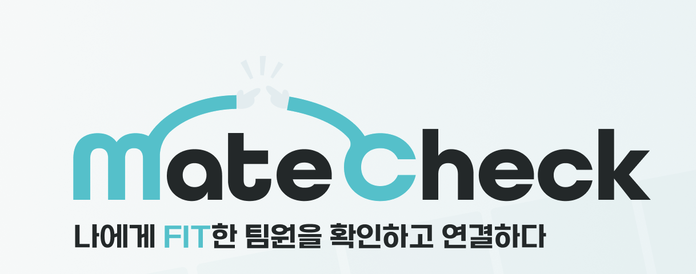</div>

# 🤝 mate check

### 나에게 FIT한 팀원 찾기

[](https://matecheck.vercel.app)
[](https://matecheck.co.kr)
[](https://matecheck.co.kr/swagger-ui/index.html)

**대학생들이 수업, 프로젝트, 동아리 등에서 자신에게 맞는 팀원을 찾고,**
**동료평가를 통해 신뢰할 수 있는 협업 파트너를 선택할 수 있도록 돕는 플랫폼**

[🌐 서비스 바로가기](https://matecheck.vercel.app) | [📖 API 문서](https://matecheck.co.kr/swagger-ui/index.html) | [🎨 Figma](https://www.figma.com/design/RDQcHRfbINs9sp6sBVHAQQ)

---

## 📌 자기소개 및 역할 분담

   


> ERD 및 API 명세서는 두 사람이 함께 진행하였습니다.

| 이름    | 주요 담당 기능                                                                                              |
|-------|-------------------------------------------------------------------------------------------------------|
| 🔥이상헌 | - OAuth 기반 로그인<br>- 사용자 프로필 관리 관련 기능<br>- AWS S3 파일 업로드<br>- 동료평가 시스템                                 |
| 🥷조귀호 | - mate check!(매칭 요청)<br>-팀원 모집 관련 기능|

---


## 📌 프로젝트 정보

| 항목                  | 내용                                                           |
| ------------------- | ------------------------------------------------------------ |
| 🚀 **배포 주소**        | [https://matecheck.vercel.app](https://matecheck.vercel.app) |
| 🔗 **API Base URL** | [https://matecheck.co.kr](https://matecheck.co.kr)           |
| ⏱️ **개발 기간**        | 3주                                                           |

---

## 🛠️ 기술 스택

### Backend


### Database


### Infrastructure


### Authentication


### Tools


---
## 🌊 주요 플로우

<details>
  <summary><b>1. 메인 소개 페이지</b></summary>

  <div>
    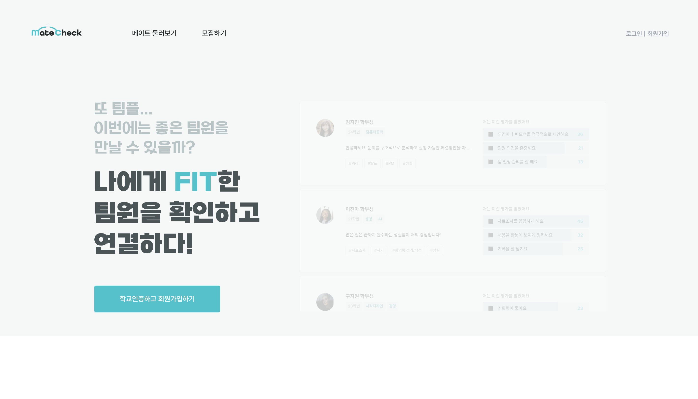
    
    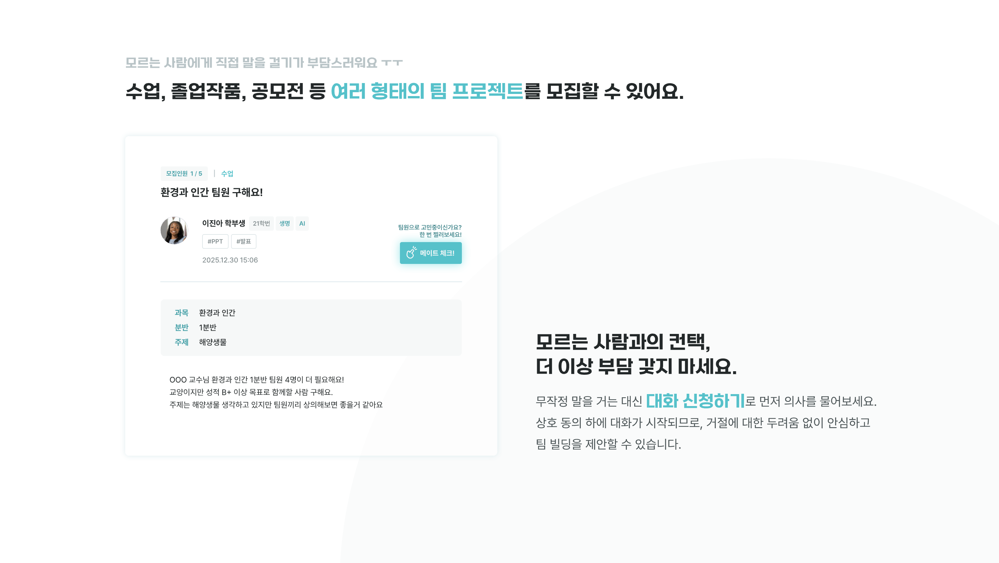
    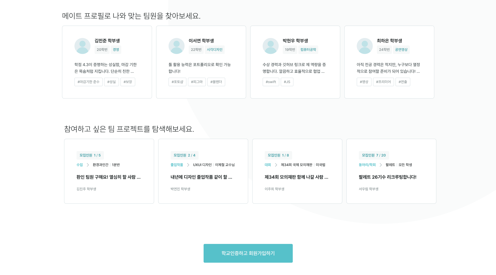
  </div>

</details>

---

<details>
  <summary><b>2. 로그인 / 회원가입</b></summary>

  <div>
    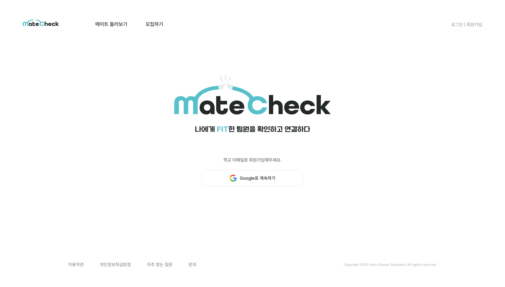
    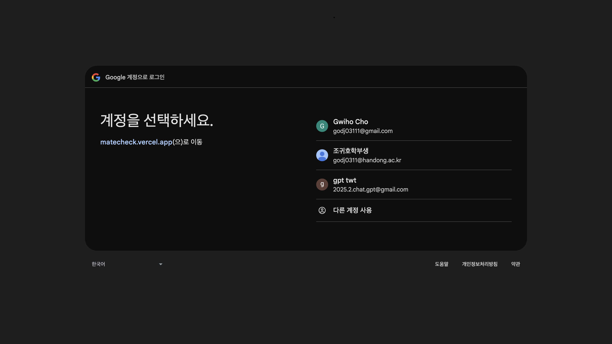
    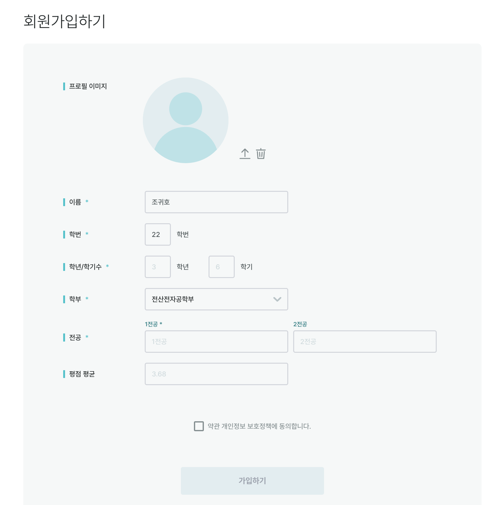
  </div>

</details>

---

<details>
  <summary><b>3. 메이트 둘러보기 및 상세보기</b></summary>

  <div>
    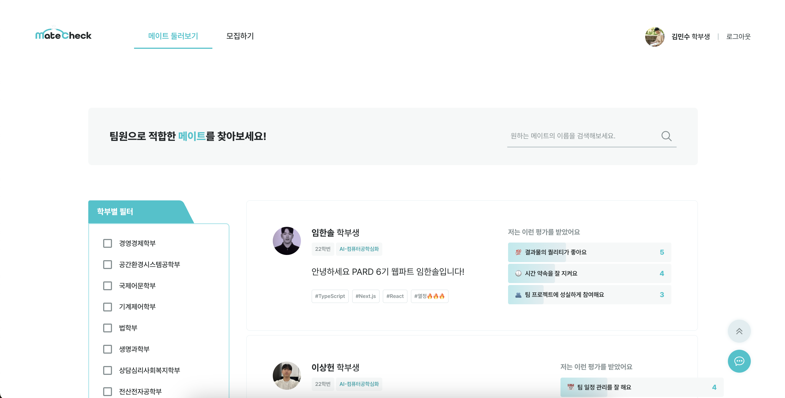
    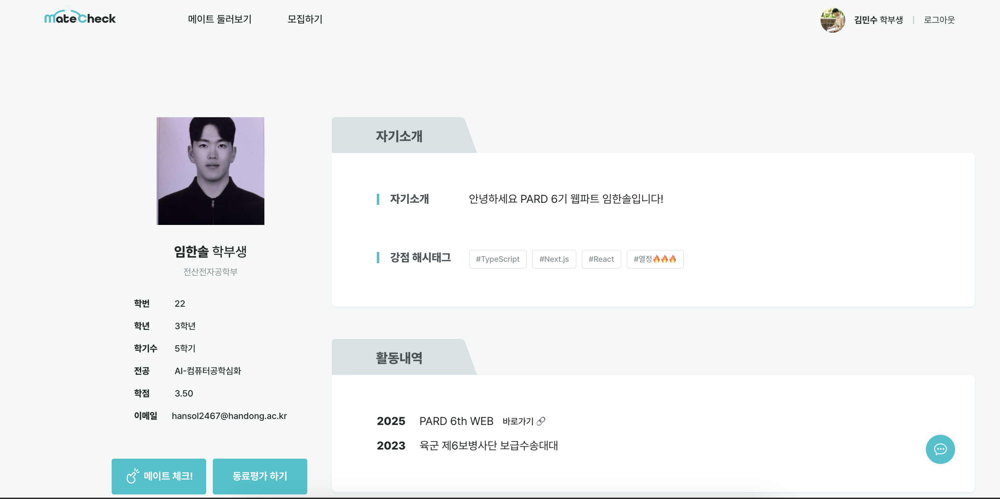
    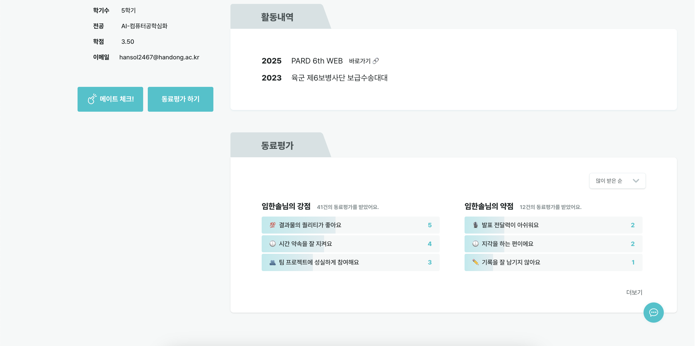
  </div>

</details>

---

<details>
  <summary><b>4. 모집하기 둘러보기 및 상세보기</b></summary>

  <div>
    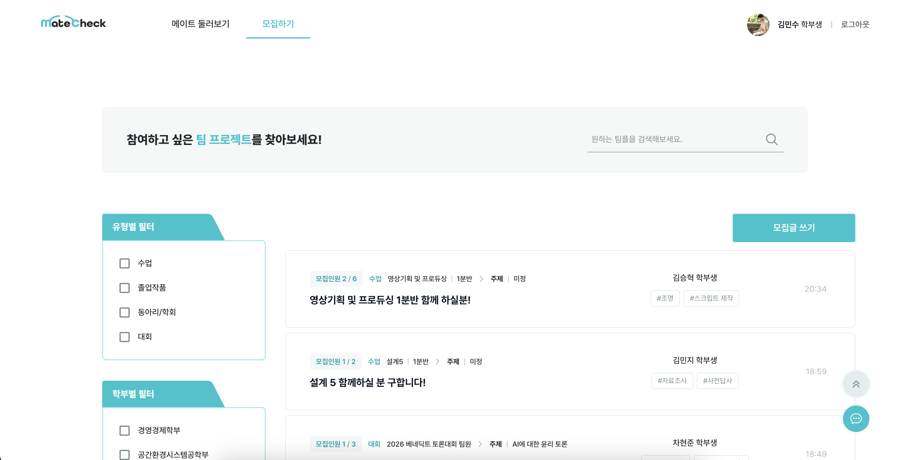
    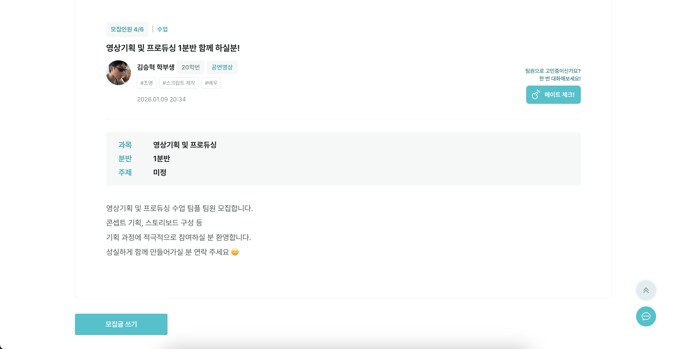
  </div>

</details>

---

<details>
  <summary><b>5. 모집하기 작성</b></summary>

  <div>
    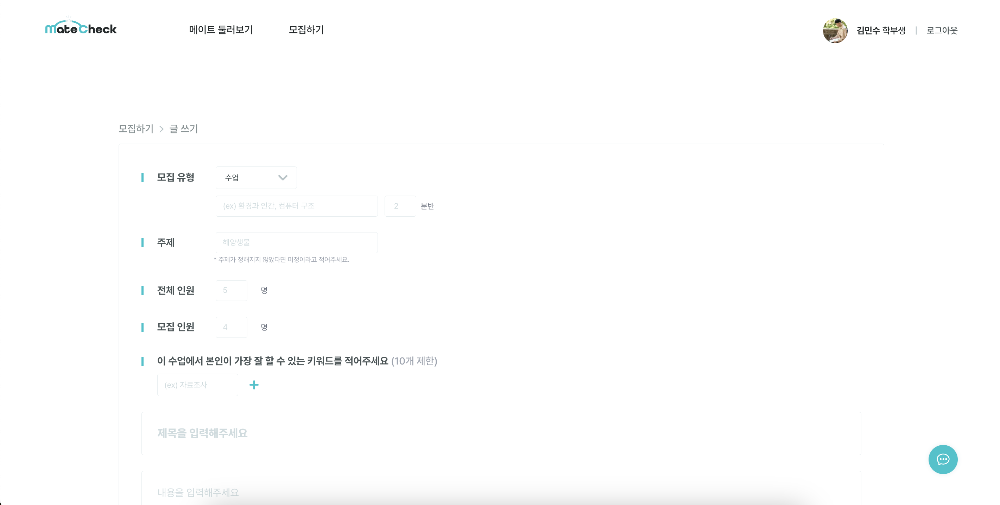
  </div>

</details>

---

<details>
  <summary><b>6. mate check</b></summary>

  <div>
    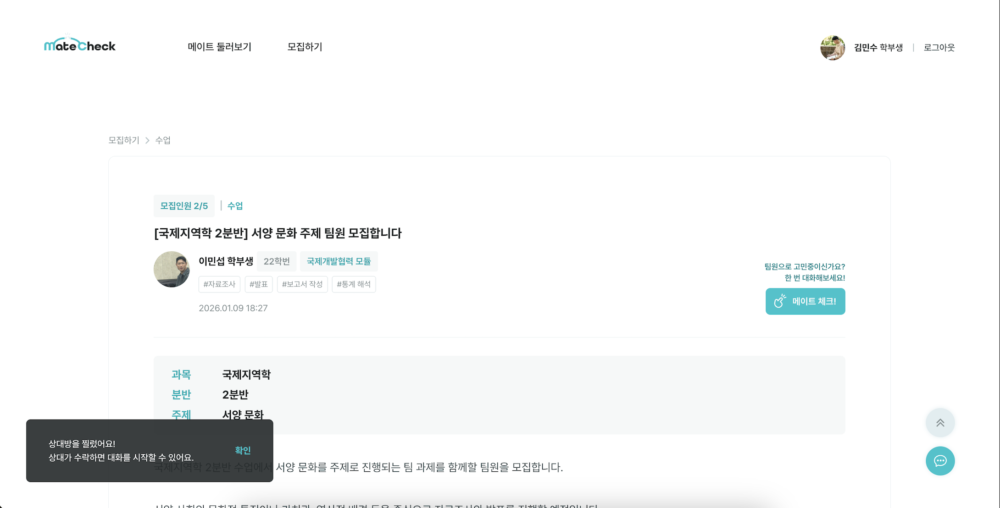
    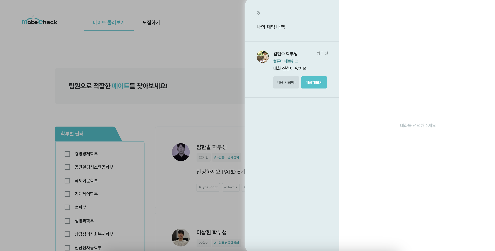
  </div>

</details>

---

<details>
  <summary><b>7. mate check 수락 시 채팅</b></summary>

  <div>
    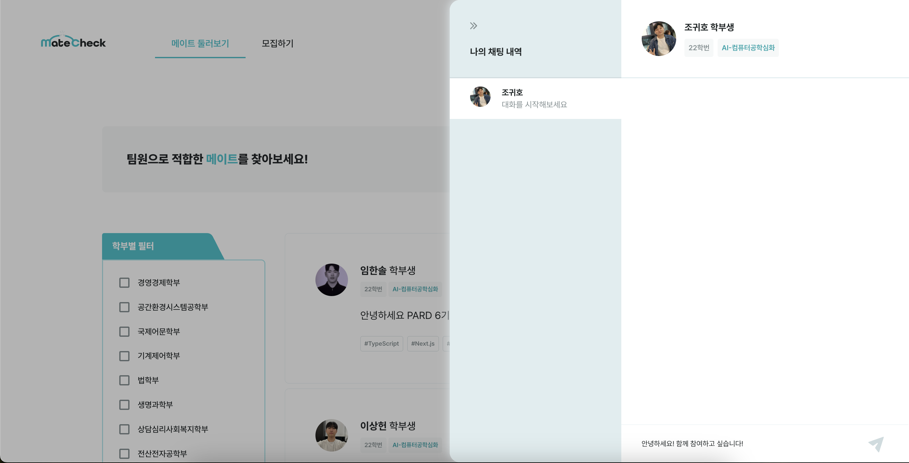
  </div>

</details>
---

## ✨ 핵심 기능

<table>
<tr>
<td width="50%">

### 🔐 인증 시스템

* Google OAuth 2.0 기반 소셜 로그인
* ID Token 검증 및 사용자 존재 여부 확인
* 회원가입 시 프로필 이미지 업로드 지원

### 👤 사용자 프로필 관리

* 프로필 CRUD (생성, 조회, 수정, 삭제)
* 학적 정보, 전공, 학점, 강점 해시태그 관리
* 활동 내역 기록
* 한줄 소개 작성

### 📝 팀원 모집

* 모집하기 작성 및 관리
* 프로젝트 타입별 필터링 (수업, 졸작, 동아리, 학회, 대회)
* 학부 및 이름 기반 검색
* 가장 잘할 수 있는 키워드 태그 시스템 (최대 10개)

</td>
<td width="50%">

### ⭐ 동료평가 시스템

* 강점/약점 키워드 기반 평가
* 키워드별 누적 집계
* 최신순 동료평가 목록 조회
* Top 3 키워드 자동 산출

### 💌 mate check! (매칭 요청)

* 모집하기 또는 프로필에서 mate check!
* 중복 mate check! 방지
* mate check! 수신 목록 관리
* 수락/거절 처리 시 서버 내부 알림 생성
* 알림 목록 조회 및 확인(삭제)

### 📁 파일 관리

* S3 기반 프로필 이미지 업로드/삭제
* UUID 기반 파일명 중복 방지
* 이미지 URL 자동 생성

</td>
</tr>
</table>

---

## 🏗️ 아키텍처

### 배포 구조

```
GitHub Repository
    ↓ (push)
EC2 Server
    ↓ (pull & build)
Spring Boot Application (Port 8080)
    ↓
Nginx (Port 80/443)
    ↓ (reverse proxy)
Client (matecheck.vercel.app)
```

**배포 프로세스**

1. 로컬에서 GitHub로 push
2. EC2 서버에서 수동으로 pull 후 빌드
3. Nginx를 통한 리버스 프록시 및 HTTPS 적용
4. S3를 통한 정적 파일(이미지) 관리

### 프로젝트 구조 (DDD 지향)

```
📦 src/main/java/pard/server/com/longkathon/
├── 📂 config/                    # 설정 파일
│   ├── CorsConfig.java
│   ├── SecurityConfig.java
│   ├── SwaggerConfig.java
│   └── WebMvcConfig.java
├── 📂 googleLogin/               # OAuth 인증
│   ├── AuthController.java
│   ├── GoogleTokenParser.java
│   └── GoogleUserInfo.java
├── 📂 MyPage/                    # 사용자 프로필 도메인
│   ├── user/
│   ├── userFile/
│   ├── introduction/
│   ├── activity/
│   ├── skillStackList/
│   ├── peerReview/
│   ├── peerGoodKeyword/
│   └── peerBadKeyword/
├── 📂 posting/                   # 모집하기 도메인
│   ├── recruiting/
│   └── myKeyword/
├── 📂 poking/                    # mate check! 도메인
├── 📂 alarm/                     # 알림 도메인
└── 📂 s3/                        # AWS S3 연동
```

---

## 🚀 로컬 실행 방법

### 1️⃣ 사전 요구사항

* Java 17 이상
* MySQL 8.0 이상
* Gradle

### 2️⃣ 환경변수 설정

`src/main/resources/application.yml` 파일을 생성하고 아래 내용을 입력합니다:

```yaml
spring:
  datasource:
    url: jdbc:mysql://localhost:3306/{DB명}?serverTimezone=Asia/Seoul&characterEncoding=UTF-8
    username: {DB 사용자명}
    password: {DB 비밀번호}
    driver-class-name: com.mysql.cj.jdbc.Driver

  jpa:
    hibernate:
      ddl-auto: update  # 개발: update, 운영: validate 권장
    show-sql: true
    properties:
      hibernate:
        format_sql: true
        dialect: org.hibernate.dialect.MySQL8Dialect

  servlet:
    multipart:
      max-file-size: 10MB
      max-request-size: 10MB

cloud:
  aws:
    credentials:
      access-key: {AWS Access Key}
      secret-key: {AWS Secret Key}
    region:
      static: ap-northeast-2
    s3:
      bucket: {S3 버킷명}
    stack:
      auto: false

logging:
  level:
    pard.server.com.longkathon: DEBUG
```

### 3️⃣ 데이터베이스 생성

```sql
CREATE DATABASE matecheck CHARACTER SET utf8mb4 COLLATE utf8mb4_unicode_ci;
```

### 4️⃣ 실행

```bash
# Gradle로 빌드
./gradlew build

# 애플리케이션 실행
./gradlew bootRun

# 또는 JAR 파일 실행
java -jar build/libs/Longkathon-0.0.1-SNAPSHOT.jar
```

### 5️⃣ 확인

* 🌐 서버: [http://localhost:8080](http://localhost:8080)
* 📚 Swagger UI: [http://localhost:8080/swagger-ui/index.html](http://localhost:8080/swagger-ui/index.html)

---

## 📖 API 명세서

### Swagger UI로 전체 API 확인

* **로컬**: [http://localhost:8080/swagger-ui/index.html](http://localhost:8080/swagger-ui/index.html)
* **운영**: [https://matecheck.co.kr/swagger-ui/index.html](https://matecheck.co.kr/swagger-ui/index.html)

---

## 📋 상세 API 문서

<details>
<summary><b>1. 서비스 소개 페이지 API</b></summary>

### 1.1 첫 페이지 데이터 조회

**Endpoint:** `GET /user/firstPage`

**Response:**

```json
{
  "profileFeedList": [
    {
      "userId": "long",
      "name": "string",
      "firstMajor": "string",
      "secondMajor": "string",
      "studentId": "string",
      "introduction": "string",
      "skillList": ["string"],
      "peerGoodKeywords": ["string"],
      "imageUrl": "string"
    }
  ],
  "recruitingFeedList": [
    {
      "recruitingId": "long",
      "name": "string",
      "projectType": "string",
      "projectSpecific": "string",
      "classes": "string",
      "topic": "string",
      "totalPeople": "integer",
      "recruitPeople": "integer",
      "title": "string",
      "myKeyword": ["string"]
    }
  ]
}
```

* `profileFeedList`: 최근 프로필 피드 3개
* `recruitingFeedList`: 최근 팀원 구하기 게시글 3개

</details>

<details>
<summary><b>2. 구글 로그인 API</b></summary>

**Endpoint:** `POST /auth/google/exists`

프론트에서 구글로그인을 통한 idToken을 넘겨준다.

**Response:**

```json
{
  "exists": "boolean",
  "email": "string",
  "socialId": "string",
  "myId": "Long"
}
```

* `exists`: DB에 해당 유저가 존재하면 true → 회원가입페이지 스킵하고 바로 메인페이지로
* `myId`: DB에 해당 유저가 존재한다면, 유저의 id값. 앞으로 프론트는 해당 유저에 대한 페이지를 요청할때 myId로 요청한다.

</details>

<details>
<summary><b>3. 회원가입 (User) API</b></summary>

### 3.1 회원가입

**Endpoint:** `POST /user/create`

**Request Body:** profileImage와 data (JSON)을 둘다 보내야함

```javascript
const formData = new FormData();
formData.append("profileImage", file);
formData.append("data", JSON.stringify(payload));

await axios.post("http://localhost:8080/user/create", formData, {
  headers: {
    "Content-Type": "multipart/form-data",
  },
});
```

```json
{
  "name": "string",
  "studentId": "string",
  "grade": "string",
  "semester": "string",
  "department": "string",
  "firstMajor": "string",
  "secondMajor": "string",
  "phoneNumber": "string (optional)",
  "gpa": "string (optional)",
  "email": "string",
  "socialId": "string"
}
```

**Response:**

```json
{
  "myId": "long",
  "name": "string"
}
```

---

### 3.2 전체 메이트 조회 (메이트 둘러보기)

**Endpoint:** `GET /user/findAll`

**Response:** List of

```json
{
  "userId": "long",
  "name": "string",
  "firstMajor": "string",
  "secondMajor": "string",
  "studentId": "string",
  "introduction": "string",
  "skillList": ["string"],
  "peerGoodKeywords": ["string"],
  "imageUrl": "string"
}
```

---

### 3.3 메이트 필터링 검색

**Endpoint:** `GET /user/filter`

**Query Parameters:**

* `departments`: string (comma-separated, 예: "컴퓨터공학과,전자공학과")
* `name`: string (예: "홍길동")

**Example:**

```
GET /user/filter?departments=컴퓨터공학과,전자공학과&name=홍길동
```

**Response:** List of

```json
{
  "userId": "long",
  "name": "string",
  "firstMajor": "string",
  "secondMajor": "string",
  "studentId": "string",
  "introduction": "string",
  "skillList": ["string"],
  "peerGoodKeywords": ["string"],
  "imageUrl": "string",
  "goodKeywordCount": "int"
}
```

---

### 3.4.1 메이트 & 마이 프로필 조회

**Endpoint:** `GET /user/equal/{myId}/{userId}`

두 사용자 ID가 동일한지 비교합니다.

**Response:** boolean

```javascript
true  // 동일한 경우
false // 다른 경우
```

**흐름:**

1. `GET /user/equal/{myId}/{userId}` 먼저 요청
2. false일때는 `GET /user/mateProfile/{userId}` 요청
3. true일때는 `GET /user/myProfile/{myId}` 요청

---

### 메이트 프로필 띄우기

**Endpoint:** `GET /user/mateProfile/{userId}`

**Response:**

```json
{
  "name": "string",
  "email": "string",
  "department": "string",
  "firstMajor": "string",
  "secondMajor": "string",
  "gpa": "string",
  "grade": "string",
  "studentId": "string",
  "semester": "integer",
  "imageUrl": "string",
  "introduction": "string",
  "skillList": ["string"],
  "activity": [
    {
      "year": "integer",
      "title": "string",
      "link": "string"
    }
  ],
  "peerGoodKeyword": {
    "keyword1": "integer",
    "keyword2": "integer",
    "keyword3": "integer"
  },
  "goodKeywordCount": "integer",
  "peerBadKeyword": {
    "keyword1": "integer",
    "keyword2": "integer",
    "keyword3": "integer"
  },
  "badKeywordCount": "integer",
  "peerReviewRecent": [
    {
      "startDate": "string",
      "meetSpecific": "string",
      "goodKeywordList": ["string"],
      "badKeywordList": ["string"]
    }
  ]
}
```

---

### 마이프로필 띄우기

**Endpoint:** `GET /user/myProfile/{myId}`

**Response:**

```json
{
  "name": "string",
  "email": "string",
  "department": "string",
  "firstMajor": "string",
  "secondMajor": "string",
  "gpa": "string",
  "grade": "string",
  "studentId": "string",
  "semester": "integer",
  "imageUrl": "string",
  "introduction": "string",
  "skillList": ["string"],
  "activity": [
    {
      "year": "integer",
      "title": "string",
      "link": "string"
    }
  ]
}
```

---

### 3.5.1 프로필 수정 - 사진만 수정

**Endpoint:** `POST /user/updateImage/{myId}`

**Request Body:**

```
POST /user/updateImage/123
Content-Type: multipart/form-data

profileImage: [image file]
```

**Response:** `200 OK`

---

### 3.5.2 프로필 사진 삭제

**Endpoint:** `DELETE /user/myProfile/{myId}`

**Response:** `200 OK`

---

### 3.5.3 프로필 수정 - 인적사항만 수정

**Endpoint:** `PATCH /user/update/{myId}`

**Request Body:**

```json
{
  "name": "string",
  "email": "string",
  "department": "string",
  "firstMajor": "string",
  "secondMajor": "string",
  "gpa": "string",
  "studentId": "string",
  "grade": "string",
  "semester": "string",
  "imageUrl": "string",
  "introduction": "string",
  "skillList": ["string", "string"],
  "activity": [
    {
      "year": "string",
      "title": "string",
      "link": "string"
    }
  ]
}
```

**Response:** `200 OK`

---

### 3.5.4 나의 동료평가 탭

**Endpoint:** `GET /user/myPeerReview/{myId}`

**Response:**

```json
{
  "peerGoodKeyword": {
    "keyword1": "integer",
    "keyword2": "integer",
    "keyword3": "integer"
  },
  "goodKeywordCount": "integer",
  "peerBadKeyword": {
    "keyword1": "integer",
    "keyword2": "integer",
    "keyword3": "integer"
  },
  "badKeywordCount": "integer",
  "peerReviewRecent": [
    {
      "startDate": "string",
      "meetSpecific": "string",
      "goodKeywordList": ["string"],
      "badKeywordList": ["string"]
    }
  ]
}
```

</details>

<details>
<summary><b>4. 모집 (Recruiting) API</b></summary>

### 4.1 전체 모집하기 조회

**Endpoint:** `GET /recruiting/findAll`

**Response:** List of

```json
{
  "recruitingId": "long",
  "name": "string",
  "projectType": "string",
  "projectSpecific": "string",
  "classes": "string",
  "topic": "string",
  "totalPeople": "integer",
  "recruitPeople": "integer",
  "title": "string",
  "myKeyword": ["string"],
  "date": "string"
}
```

---

### 4.2 모집하기 필터링 검색

**Endpoint:** `GET /recruiting/filter`

**Query Parameters:**

* `type`: string (예: "수업", "졸작", "동아리", "학회", "대회")
* `departments`: string (comma-separated, 예: "컴퓨터공학과,전자공학과")
* `name`: string (예: "홍길동")

**Response:** List of

```json
{
  "recruitingId": "long",
  "name": "string",
  "projectType": "string",
  "projectSpecific": "string",
  "classes": "integer",
  "topic": "string",
  "totalPeople": "integer",
  "recruitPeople": "integer",
  "title": "string",
  "myKeyword": ["string"],
  "date": "string"
}
```

---

### 4.3 내가 작성한 모집하기 조회 (내가 쓴 글 탭)

**Endpoint:** `GET /recruiting/{myId}`

**Response:** List of

```json
{
  "recruiting": "long",
  "name": "string",
  "projectType": "string",
  "projectSpecific": "string",
  "classes": "string",
  "topic": "string",
  "totalPeople": "integer",
  "recruitPeople": "integer",
  "title": "string",
  "myKeyword": ["string"],
  "date": "string"
}
```

---

### 4.4.1 모집하기 상세 조회

**Endpoint:** `GET /recruiting/detail/{recruitingId}/{myId}`

**Response:**

```json
{
  "name": "string",
  "projectType": "string",
  "projectSpecific": "string",
  "classes": "string",
  "topic": "string",
  "totalPeople": "integer",
  "recruitPeople": "integer",
  "title": "string",
  "myKeyword": ["string"],
  "date": "string",
  "context": "string",
  "studentId": "string",
  "firstMajor": "string",
  "secondMajor": "string",
  "imageUrl": "string",
  "postingList": [
    {
      "recruitingId": "long",
      "name": "string",
      "projectType": "string",
      "totalPeople": "integer",
      "recruitPeople": "integer",
      "title": "string",
      "date": "string"
    }
  ],
  "canEdit": "Boolean"
}
```

**Notes:** 작성자와 로그인 계정이 동일하면 수정 가능한 UI, 다르면 수정 불가한 UI 제공

---

### 4.4.2 모집하기 수정

**Endpoint:** `PATCH /recruiting/{recruitingId}/{myId}`

**Request Body:**

```json
{
  "projectType": "string",
  "projectSpecific": "string",
  "classes": "string",
  "topic": "string",
  "totalPeople": 0,
  "recruitPeople": 0,
  "title": "string",
  "context": "string",
  "keyword": ["string", "string", "..."]
}
```

**Response:** `200 OK`

---

### 4.4.3 모집하기 삭제

**Endpoint:** `DELETE /recruiting/{recruitingId}/{myId}`

**Response:** `200 OK`

---

### 4.5 모집하기 생성

**Endpoint:** `POST /recruiting/createPost/{userId}`

**Request Body:**

```json
{
  "projectType": "string",
  "projectSpecific": "string",
  "classes": "string",
  "topic": "string",
  "totalPeople": "integer",
  "recruitPeople": "integer",
  "title": "string",
  "context": "string",
  "myKeyword": ["string"]
}
```

**Response:** `200 OK`

</details>

<details>
<summary><b>5. 동료평가 (Peer Review) API</b></summary>

### 5.1 동료평가 작성

**Endpoint:** `POST /peerReview/{myId}/{userId}`

**Path Parameters:**

* `myId`: 평가 작성자 ID
* `userId`: 평가 대상자 ID

**Request Body:**

```json
{
  "startDate": "string",
  "meetSpecific": "string",
  "goodKeywordList": ["string"],
  "badKeywordList": ["string"]
}
```

**Response:** `200 OK` (평가 생성 완료)

</details>

<details>
<summary><b>6. mate check! (Poking) API</b></summary>

### 6.1 모집하기에서 mate check! 생성

**Endpoint:** `POST /poking/{recruitingId}/{myId}`

**Response:** `200 OK` (생성 완료)

---

### 6.2 유저에게 mate check! 생성

**Endpoint:** `POST /poking/user/{userId}/{myId}`

**Path Parameters:**

* `userId`: mate check!를 **받는 사람(메이트)**
* `myId`: mate check!를 **보내는 사람(로그인 유저)**

**Response:** `200 OK` (생성 완료)

---

### 6.3 모집하기에서 mate check! 가능 여부 조회

**Endpoint:** `GET /poking/canInRecruiting/{recruitingId}/{myId}`

**Response:**

```json
{
  "canPoke": "boolean",
  "reason": "string"
}
```

---

### 6.4 유저 → 유저 mate check! 가능 여부 조회

**Endpoint:** `GET /poking/canInProfile/{userId}/{myId}`

**Response:**

```json
{
  "canPoke": "boolean",
  "reason": "string"
}
```

---

### 6.5 mate check! 조회 (내가 받은 mate check! 목록)

**Endpoint:** `GET /poking/received/{myId}`

**Response:** List of

```json
[
  {
    "pokingId": "long",
    "recruitingId": "long",
    "senderId": "long",
    "senderName": "string",
    "projectSpecific": "string",
    "date": "string",
    "imageUrl": "string"
  }
]
```

---

### 6.6 mate check! 삭제 (수락/거절 처리)

> mate check!를 삭제하며,
> **수락(true) / 거절(false)** 여부에 따라 서버 내부에서 알림이 생성됩니다.

**Endpoint:** `DELETE /poking/{pokingId}`

**Request Body:**

```json
{
  "ok": "boolean"
}
```

---

### 6.7 알림 확인 (해당 유저가 받은 모든 알림 조회)

**Endpoint:** `GET /alarm/{userId}`

**Response:** List of

```json
[
  {
    "alarmId": 1,
    "senderName": "홍길동",
    "ok": true
  },
  {
    "alarmId": 2,
    "senderName": "김철수",
    "ok": false
  }
]
```

---

### 6.8 알림 삭제 (확인 버튼 클릭 시)

**Endpoint:** `DELETE /alarm/{alarmId}`

**Response:** `200 OK`

---

### 6.9 채팅 생성 (수락 처리)

> mate check! 수락(`ok=true`) 처리 시 채팅 생성 로직이 함께 수행될 수 있습니다.

**Endpoint:** `DELETE /poking/{pokingId}`

**Response:** `200 OK`

</details>

---

## 🗄️ ERD

### 주요 테이블 구조
<div align="center">
  
</div>


### 트러블슈팅

* **Google 로그인 방식 정리**

  * 문제: “일반 로그인(JWT/세션)”과 달리 `idToken` 기반 흐름이라 팀 내에서 인증/인가 범위가 헷갈림
  * 대응: `POST /auth/google/exists`에서 `idToken → (email/socialId) 추출 → exists/myId 반환` 흐름으로 문서화


* **EC2 수동 배포로 인한 설정 불일치**

  * 문제: 로컬과 EC2 환경변수/설정 파일 차이로 실행 오류가 발생하기 쉬움
  * 대응: `application.yml` 분리 + 환경변수 목록을 정리하고, 배포 시 체크리스트(필수 env, DB 연결, S3 권한)를 만들어 공유


* **이미지 업로드(멀티파트) 디버깅**

  * 문제: `multipart/form-data`에서 `profileImage` + `data(JSON string)`를 함께 전송할 때 키 이름/Content-Type 실수로 400/415 발생
  * 대응: 프론트 요청 예시(FormData)와 서버 요구 파라미터 이름을 명세에 고정, Postman으로 먼저 검증 후 프론트 적용


* **ERD/도메인 설계 변경 비용**

  * 문제: 화면/API 변경이 생길 때 ERD가 같이 흔들리며 수정 비용이 커짐
  * 대응: 키워드/리뷰처럼 변화가 잦은 영역은 “정규화 vs 집계 테이블” 기준을 세우고, 누적 집계(GOOD/BAD) 테이블로 조회 성능을 확보


* **서버 시간대(UTC)로 인해 생성 시간이 한국 시간과 다르게 저장됨**
  - 문제: AWS 서버 리전/기본 타임존 설정 영향으로 `LocalDateTime.now()` 기준 시간이 한국 시간(KST)과 어긋나, 모집글/찌르기 생성 시간이 프론트에서 기대한 시간과 다르게 보임
  - 원인: 서버 환경(예: UTC 또는 다른 타임존) 기준으로 애플리케이션 시간이 생성됨
  - 대응: `Recruiting`, `Poking` 엔티티에 `@PrePersist`를 추가해 저장 직전에 KST(Asia/Seoul) 기준으로 `date`를 세팅

  **Recruiting**
    ```java
    import java.time.ZoneId;

    @PrePersist
    public void prePersist() {
        if (this.date == null) {
            this.date = LocalDateTime.now(ZoneId.of("Asia/Seoul"))
                    .truncatedTo(java.time.temporal.ChronoUnit.MINUTES);
        }
    }
    ```

  **Poking**
    ```java
    import java.time.ZoneId;

    @PrePersist
    public void prePersist() {
        if (this.date == null) {
            this.date = LocalDateTime.now(ZoneId.of("Asia/Seoul"));
        }
    }
    ```


---

### 회고 (잘한 점)

* **3주 내 “기능 완성 + 배포”까지 도달**

  * OAuth 기반 인증 흐름을 구현하고, Nginx/HTTPS를 포함한 실서비스 형태로 끝까지 연결
* **조회 성능을 고려한 설계 시도**

  * 동료평가 키워드 Top3/Count 요구사항을 누적 집계 테이블로 분리해 조회를 단순화
* **API 명세 중심 협업**

  * 화면 흐름(동일 유저 여부 판별, canEdit 등)을 명세에 반영해 프론트와 합의점을 만들고 개발 진행

---

### 개선 계획 (다음 단계)

* **인증 고도화**

  * `idToken`은 “최초 로그인 검증”에만 사용
  * 서버가 `access/refresh JWT`를 발급하고, 권한/만료/재발급 흐름을 표준화

* **Docker 기반 배포 전환**

  * Spring + MySQL(+Nginx) 컨테이너화로 실행 환경을 고정
  * `docker compose`로 로컬/서버 환경을 동일하게 맞추기

* **CI/CD 도입**

  * GitHub Actions로 빌드/테스트 후 EC2 배포 자동화
  * 배포 실패 시 롤백 또는 이전 버전 유지 전략 수립

* **운영 기본기 추가**

  * 로그(구조화 로그), 모니터링(헬스체크/메트릭) 적용
  * 프로세스 매니저(systemd) 또는 컨테이너 재시작 정책으로 안정성 확보

* **DB/도메인 리팩토링**

  * 변화가 잦은 도메인(키워드/리뷰/프로필 확장)에 대해 스키마 정책 정리
  * 인덱스/쿼리 튜닝 및 조회 API의 페이지네이션 도입
